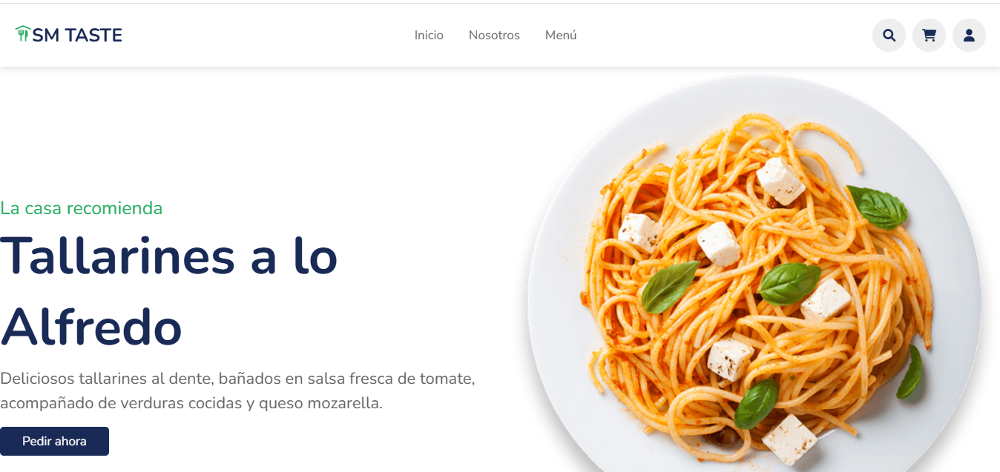
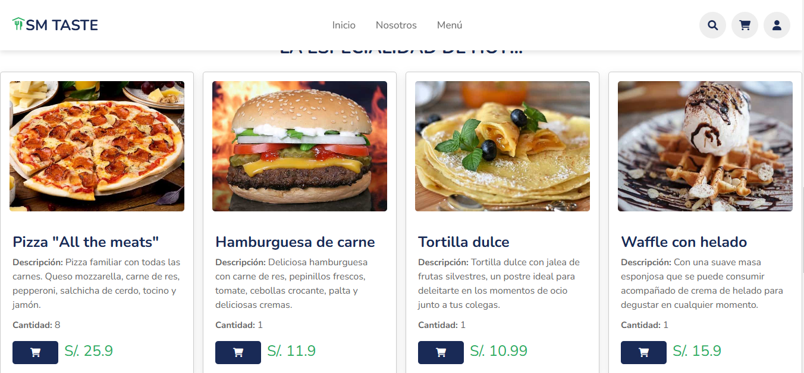
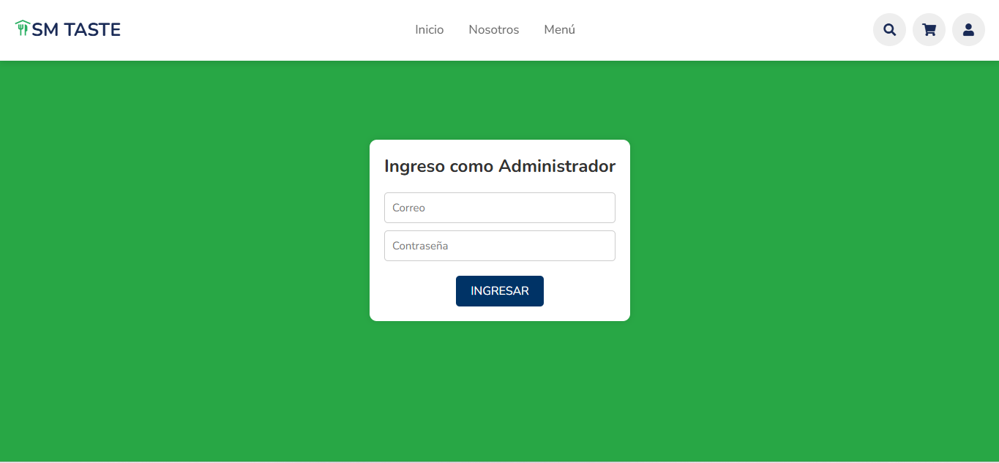
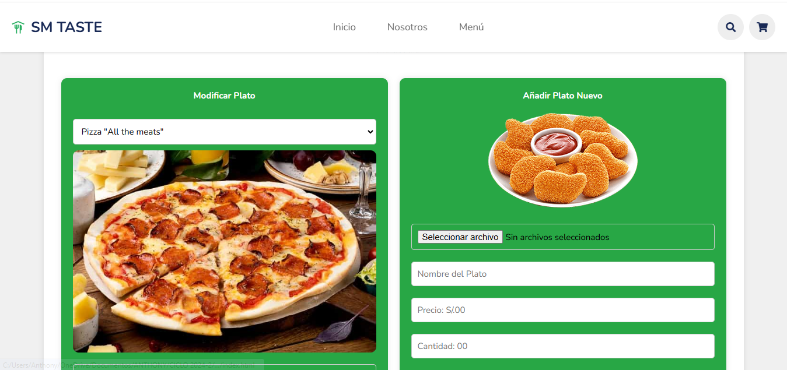
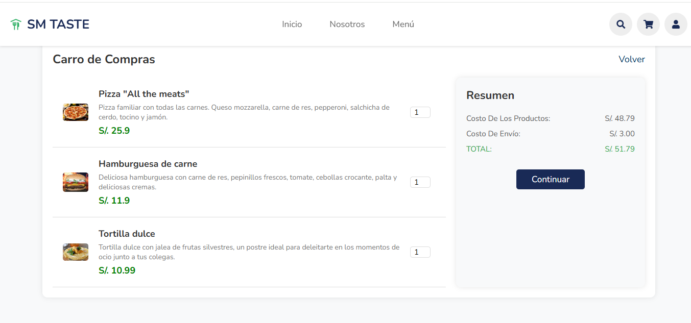

# PROYECTO DE VERIFICACION Y VALIDACION DE SOFTWARE
GRUPO 6

# INTEGRANTES
- Fredy Anthony Huerta Firma
- Joseph Rodolfo Flores Hilario
- Jhordan Brayan Medina Montoya
- Carlos Antonio Romero Llamoca
- Salazar Herrera Oscar Miguel
- Guerra Camana Pablo Francisco

# NOMBRE DEL PROYECTO
SM-TASTE

# PROPÓSITO DEL PROYECTO
Elaborar un prototipo funcional de un programa de conexión de cafeterías internas 
que permita ver y ordenar el menú de las principales cafeterías de una universidad, 
así como administrar el menú al ingresar como empleado de la cafetería; para la evaluación 
de su usabilidad entre los estudiantes y profesores y demás personal de la Universidad 
Nacional Mayor de San Marcos. 

# FUNCIONALIDADES PRINCIPALES

## PÁGINA PRINCIPAL

## MENÚ DEL DÍA 

## LOGIN

## PANEL DEL ADMINISTRADOR

## CARRITO DE COMPRAS

## CONFIGURACIÓN DEL PIPELINE EN JENKINS
Configuración del Pipeline en Jenkins
El siguiente es un Jenkinsfile que define el pipeline del proyecto SMTASTE. Este archivo automatiza varias etapas del proceso de integración continua, que incluyen la construcción del proyecto, la ejecución de pruebas y la implementación de medidas de seguridad y rendimiento.
pipeline {
    agent any
    tools {
        jdk 'JAVA'
        maven 'maven'
    }
    
    environment {
        SCANNER_HOME = tool 'sonar-scanner'
        ZAP_HOME = 'C:\\Program Files\\ZAP\\Zed Attack Proxy\\zap.bat'
    }

    stages {
        stage("Git Checkout") {
            steps {
                git changelog: false, poll: false, url: 'https://github.com/anthonyhuertafirma/Proyecto-SMTASTE.git'
            }
        }
        stage("Cambio de Rama a Master") {
            steps {
                bat "git checkout master"
            }
        }
        stage("Build with Maven") {
            steps {
                dir('back-end/restaurant') {
                    bat "mvn clean compile"
                }
            }
        }
        stage("Test Unit-Func") {
            steps {
                dir('back-end/restaurant') {
                    bat "mvn test"
                }
            }
        }
        stage('OWASP ZAP Security Scan') {
            steps {
                dir('back-end/restaurant/src/test/security-tests') {
                    script {
                        def zapJarPath = '"C:/Program Files/ZAP/Zed Attack Proxy/zap-2.15.0.jar"'
                        def targetUrl = 'http://localhost:8096/api/productos'
                        def reportPath = 'zap-reports/zap-report.html'
                        bat 'if not exist zap-reports mkdir zap-reports'
                        bat "java -Xmx512m -jar ${zapJarPath} -cmd -host localhost -port 8097 -quickurl ${targetUrl} -quickout ${reportPath}"
                    }
                }
            }
        }
        stage("JMeter Performance Test") {
            steps {
                dir('back-end/restaurant/src/test/performance') {
                    script {
                        def jmeterPath = 'D:\\Jmeter\\apache-jmeter-5.6.3\\bin\\jmeter.bat'
                        def testPlans = ['PruebasProducto1.jmx', 'PruebasProducto2.jmx', 'PruebasCarrito.jmx']
                        testPlans.each { testPlan ->
                            bat "${jmeterPath} -n -t ${testPlan} -l results_${testPlan.replace('.jmx', '')}.jtl -e -o report_${testPlan.replace('.jmx', '')}"
                        }
                    }
                }
            }
        }
        stage("SonarQube Analysis") {
            steps {
                bat "$SCANNER_HOME/bin/sonar-scanner -Dsonar.url=http://localhost:9000/ \
                -Dsonar.login=sqp_477b7ad4ed6e99116629b3ccd7e9af85eb25b34d \
                -Dsonar.projectKey=Proyecto_Restaurante_2 \
                -Dsonar.projectName='Proyecto_Restaurante' \
                -Dsonar.sources=. \
                -Dsonar.java.binaries=. "
            }
        }
    }
}

Explicación del Pipeline en Jenkins:
Agent and Tools:
agent any: Indica que el pipeline puede ejecutarse en cualquier agente disponible.
tools: Define las herramientas necesarias para ejecutar el pipeline, en este caso, el JDK y Maven.
Environment Variables:
Se configuran variables de entorno como SCANNER_HOME para SonarQube y ZAP_HOME para OWASP ZAP.
Stages: El pipeline se divide en diferentes etapas:
Git Checkout: Clona el repositorio desde GitHub.
Cambio de Rama a Master: Asegura que se trabaje con la rama principal (master).
Build with Maven: Ejecuta mvn clean compile para construir el proyecto.
Test Unit-Func: Ejecuta las pruebas unitarias y funcionales con Maven.
OWASP ZAP Security Scan: Realiza un escaneo de seguridad en la API utilizando OWASP ZAP.
JMeter Performance Test: Ejecuta las pruebas de rendimiento con JMeter.
SonarQube Analysis: Ejecuta el análisis estático de SonarQube para evaluar la calidad del código.
Gestión de Issues
Registro de Defectos: Los defectos se registran en GitHub Issues.
División de Esfuerzos: Usando Trello, el trabajo se organiza en tareas con estimaciones de tiempo, responsables y etiquetas.

